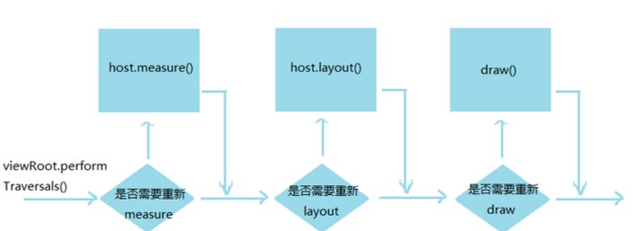
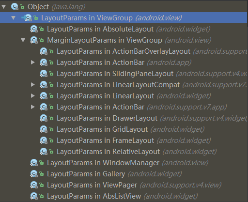
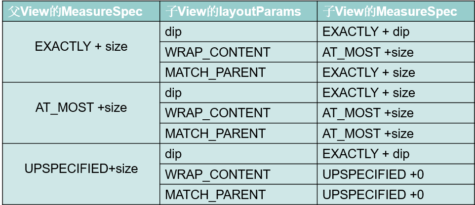
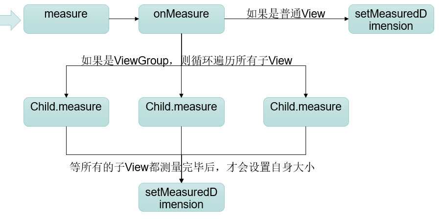

# 1 View的绘制流程

一个view要显示在界面上，需要经历一个view树的遍历过程，这个过程又可以分为三个过程，分别是：

`measure（测量） -> layout（布局） --> draw（绘制）`

*   测量 确定一个View的大小
*   布局 确定view在父节点上的位置
*   绘制 绘制view 的内容

这个过程的启动时一个叫ViewRoot.java类中 performTraversals（）函数发起的，子view也可以通过一些方法来请求重新遍历view树，但是在遍历过程view树时并不是所有的view都需要重新测量，布局和绘制，在view树的遍历过程中，系统会问view是否需要重新绘制，如果需要才会真的去绘制view。
>View有一个内部标识 mPrivateFlags，用来记录view是否需要进行某些操作

流程图如下所示：

接下来具体分析View的各个流程

---
    

# 2 测量(Measure)

## 2.1 measure方法分析
测量用来确定一个View的大小，在ViewRoot中的performTraversals()中，调用decorView的measure方法，measure方法接收两个参数，

最初的两个参数在ViewRoot方法中产生：

     private static int getRootMeasureSpec(int windowSize, int rootDimension) {
                                 int measureSpec;
                                 switch (rootDimension) {
                                         case ViewGroup.LayoutParams.MATCH_PARENT:
                                             // Window不能调整其大小，强制使根视图大小与Window一致
                                             measureSpec = MeasureSpec.makeMeasureSpec(windowSize, MeasureSpec.EXACTLY);
                                         break;

                                         case ViewGroup.LayoutParams.WRAP_CONTENT:
                                             // Window可以调整其大小，为根视图设置一个最大值
                                             measureSpec = MeasureSpec.makeMeasureSpec(windowSize, MeasureSpec.AT_MOST);
                                         break;

                                         default:
                                             // Window想要一个确定的尺寸，强制将根视图的尺寸作为其尺寸
                                             measureSpec = MeasureSpec.makeMeasureSpec(rootDimension, MeasureSpec.EXACTLY);
                                         break;
                                 }
                                 return measureSpec;
                         }

由此可见一般情况下，初始值都是窗口的大小。

接下来分析measure方法：

    public final void measure(int widthMeasureSpec, int heightMeasureSpec) {
            //如果要求重新布局肯定要先测量
            if ((mPrivateFlags & FORCE_LAYOUT) == FORCE_LAYOUT ||
            //如果测量规格变了
                    widthMeasureSpec != mOldWidthMeasureSpec ||
                    heightMeasureSpec != mOldHeightMeasureSpec) {
                // 需要重新绘制则把标识置为没有设置尺寸
                mPrivateFlags &= ~MEASURED_DIMENSION_SET;
                // 这里调用onMeasure方法，来进行真正的测量
                onMeasure(widthMeasureSpec, heightMeasureSpec);
                //如果onMeasure完毕没有设置测量尺寸，抛异常
                if ((mPrivateFlags & MEASURED_DIMENSION_SET) != MEASURED_DIMENSION_SET) {
                    throw new IllegalStateException("onMeasure() did not set the"
                            + " measured dimension by calling"
                            + " setMeasuredDimension()");
                }
                //恢复标识位
                mPrivateFlags |= LAYOUT_REQUIRED;
            }
            //记录测量后设置的测量规格
            mOldWidthMeasureSpec = widthMeasureSpec;
            mOldHeightMeasureSpec = heightMeasureSpec;
        }

流程很清晰measure方法是fianl的，子类无法重写，所以只能通过onMeasure方法来实现自己的测量逻辑，在onMeasure中必须调用**setMeasuredDimension**方法，否则抛出异常。

---
 

## 2.2 系统默认的onMeasure流程

再来看一下onMeasure的默认实现：

      protected void onMeasure(int widthMeasureSpec, int heightMeasureSpec) {
            setMeasuredDimension(getDefaultSize(getSuggestedMinimumWidth(), widthMeasureSpec),
                    getDefaultSize(getSuggestedMinimumHeight(), heightMeasureSpec));
        }

看一下获取建议的最小宽度逻辑：

        protected int getSuggestedMinimumWidth() {
        //mMinWidth默认是0
            int suggestedMinWidth = mMinWidth;
            //如果设置了view的背景，那么根据mBGDrawable来获取一个大小
            //而Drawable是否有宽度不确定，比如ShapeDrawable没有原始宽高
            //BitmapDrawable有原始宽高(图片的宽高)
            if (mBGDrawable != null) {
                final int bgMinWidth = mBGDrawable.getMinimumWidth();
                //如果最小宽度小于Drawable的宽度，还是取drawable的宽度
                if (suggestedMinWidth < bgMinWidth) {
                    suggestedMinWidth = bgMinWidth;
                }
            }
            return suggestedMinWidth;
        }

**因此如果View没有背景那么getSuggestedMinimumWidth返回0，有背景根据设置背景的不同而不同。**

然后是getDefaultSize的逻辑

    public static int getDefaultSize(int size, int measureSpec) {
            int result = size;//记录传入的建议尺寸
            //获取测量规格与尺寸
            int specMode = MeasureSpec.getMode(measureSpec);
            int specSize = MeasureSpec.getSize(measureSpec);

            switch (specMode) {
            //父view对子view的搞定没有要求，则使用建议的高度
            case MeasureSpec.UNSPECIFIED:
                result = size;
                break;
            //如果是下面两种模式则使用测量规格传入的尺寸，而这个specSize就是父view传入的尺寸。
            case MeasureSpec.AT_MOST:
            case MeasureSpec.EXACTLY:
                result = specSize;
                break;
            }
            return result;
        }

最后规定onMeasure就是调用setMeasuredDimension来设置尺寸了

     protected final void setMeasuredDimension(int measuredWidth, int measuredHeight) {
            mMeasuredWidth = measuredWidth;
            mMeasuredHeight = measuredHeight;
            //恢复标志位
            mPrivateFlags |= MEASURED_DIMENSION_SET;
        }

**只有调用setMeasuredDimension才能获取子view的测量高度(宽度)**，下面方法可以说明，也就是说只有view的measure方法执行完了，调用getMeasuredHeight(getMeasuredWidth)才有意义。

        public final int getMeasuredHeight() {
            return mMeasuredHeight & MEASURED_SIZE_MASK;
        }

分析系统的onMeasure方法，可知默认的系统只支持EXACTLY模式，AT_MOST的处理和EXACTLY是一样的，自定义控件，肯定需要处理AT_MOST的测量模式。而UNSPECIFIED一般出现在可以滚动的view中。

---
 

 
---

# 3 MeasureSpec
上面说到View的测量模式，测量规格等，这些东西都封装在MeasureSpec中，现在来学习一下这个类

    MeasureSpec {
            //MODE_SHIFT是位偏移数
            private static final int MODE_SHIFT = 30;
            //模式遮罩
            private static final int MODE_MASK  = 0x3 << MODE_SHIFT;
            //三种模式
            public static final int UNSPECIFIED = 0 << MODE_SHIFT;
            public static final int EXACTLY     = 1 << MODE_SHIFT;
            public static final int AT_MOST     = 2 << MODE_SHIFT;
            //获取模式
            public static int getMode(int measureSpec) {
                return (measureSpec & MODE_MASK);
            }
            //获取尺寸
            public static int getSize(int measureSpec) {
                return (measureSpec & ~MODE_MASK);
            }
          ......
        }

代码还是很简单的：

用一个int型变量来表示一个测量规格，我们知道int型有32位，而MODE_SHIFT=30，三种模式用二进制表示分别是：

- UNSPECIFIED：0<< MODE_SHIFT;
- EXACTLY：01 << MODE_SHIFT;
- AT_MOST：10 << MODE_SHIFT;

都向左边移动了30位，然后再根据getMode和getSize的计算逻辑分析，我们可以知道：
用一个int型的二进制形式来表示一个测量规格，前2位标识测量模式，后30位标识测量尺寸，那么这三种模式分别表示什么意思呢？

- UNSPECIFIED：表示父容器不对子view的大小做任何要求
- EXACTLY：表示父容器确定了子view的大小，就是测量规格中的尺寸
- AT_MOST：表示父容器不能确定子view大小，但是要求子view的大小不能超过测量规格中指定的尺寸

这里我们要明白一个概念，屏幕是有大小的，而View可以说是没有大小限制的，View可以很大很大(比如地图view中的MapView),只是view通过屏幕展示出来收到屏幕大小的限制而已。

---
 

 
---

# 4 LayoutParams

LayoutParams描述了View的大小，对其方式等信息，而每个ViewGroup都可以根据自身的layout特性来定制自己的LayoutParams，我们来看一下系统中的LayoutParams：

可以看到确实是这样的，系统中的各中ViewGroup都有自己的LayoutParams实现，大部分都集成MarginLayoutParams。
ViewGroup.LayoutParams是其他所有LayoutParams的父类，而MarginLayoutParams多了margin的特性，如果要考虑margin，就得继承MarginLayoutParams。

每个处于ViewGroup的View必然有自己的LayoutParams对象，不管是从xml布局中layout的，还是用代码add进ViewGroup的，看一下LayoutParams的生成方式：

在LayoutInfalater的inflate中：

    if (root != null) {
                            if (DEBUG) {
                                System.out.println("Creating params from root: " +
                                        root);
                            }
                            // Create layout params that match root, if supplied
                            params = root.generateLayoutParams(attrs);
                            if (!attachToRoot) {
                                // Set the layout params for temp if we are not
                                // attaching. (If we are, we use addView, below)
                                temp.setLayoutParams(params);
                            }
                        }

在代码addView中：

    public void addView(View child, int index) {
            if (child == null) {
                throw new IllegalArgumentException("Cannot add a null child view to a ViewGroup");
            }
            LayoutParams params = child.getLayoutParams();
            if (params == null) {
                params = generateDefaultLayoutParams();
                if (params == null) {
                    throw new IllegalArgumentException("generateDefaultLayoutParams() cannot return null");
                }
            }
            addView(child, index, params);
        }

可以看到，View的LayoutParams可能在inflate中根据xml指定的属性被构建并指定，然后即使没有，只要一个View被添加到ViewGroup中，那么必然调用添加它的ViewGroup的相关方法来生成它的LayoutParams，所以说View的LayoutParams取决于它的父容器，而且如果在把一个View添加到ViewGroup前指定了LayoutParams参数，而这个LayoutParams与它的父容器不匹配就会报错，因为ViewGroup会检查被添加View的LayoutParams：

这个方法是`checkLayoutParams`

比如LinearLayout的checkLayoutParams方法：

    protected boolean checkLayoutParams(ViewGroup.LayoutParams p) {
        return p instanceof LinearLayout.LayoutParams;
    }

所以在自定义ViewGroup的时候，如果我们需要实现自己的LayoutParams，那么最好重写相关的关于LayoutParams方法，而且在自定义ViewGroup时，如果我们需要考虑margin，可能会调用到下面一个方法`measureChildWithMargins`，有这么一段逻辑`final MarginLayoutParams lp = (MarginLayoutParams) child.getLayoutParams();`，如果我们用到measureChildWithMargins这个方法，又没有重写相关方法，必然会报错。因为ViewGroup默认的现实是构造ViewGroup.LayoutParams.

如果自定义LayoutParams一般需要重写的方法有：

    1：生成默认的布局参数

    generateDefaultLayoutParams()

    2：生成布局参数 ，从属性配置中生成我们的布局参数

    android.view.ViewGroup.LayoutParams generateLayoutParams(android.view.ViewGroup.LayoutParams p){
                                 return new CustomLayoutParams(p);
                 }

    android.view.ViewGroup.LayoutParams generateLayoutParams(AttributeSet attrs){
                                   return new CustomLayoutParams(getContext() , attrs);
                  }

    3：检查当前布局参数是否是我们定义的类型这在code声明布局参数时常常用到
    protected boolean checkLayoutParams(android.view.ViewGroup.LayoutParams p) {
                        return p instanceof CustomLayoutParams;
                     }

---

## 4.1 LayoutParams中指定的宽高与测量的关系

下面以宽度为例子：

LayoutParams.width可以取值为：

- MATCH_PARENT(FILL_PARENT) = -1
- WRAP_CONTENT = -2
- 具体的值

这些值都可以通过xml属性指定，或者在代码中指定

而在ViewGroup方法中提供了根据这些值来获取测量规格的方法：

     public static int getChildMeasureSpec(int spec, int padding, int childDimension) {
            //测量规格中指定的模式和尺寸
            int specMode = MeasureSpec.getMode(spec);
            int specSize = MeasureSpec.getSize(spec);
            //测量规则尺寸减去padding不能小于0
            int size = Math.max(0, specSize - padding);
            //用于保存结果的临时变量
            int resultSize = 0;
            int resultMode = 0;
    //这里对父容器自身的模式进行分类处理
            switch (specMode) {
            //父容器的mode是精确的
            case MeasureSpec.EXACTLY:
            //子view指定了确切的大小
                if (childDimension >= 0) {
                //那么它的模式必然是EXACTLY的，它的尺寸就是它指定的尺寸
                    resultSize = childDimension;
                    resultMode = MeasureSpec.EXACTLY;
                    //子view指定了它要匹配父容器的大小
                } else if (childDimension == LayoutParams.MATCH_PARENT) {
                    //而且父容器的模式是EXACTLY的，那么就给它父容器的大小，
                    //而且也确定了子view的模式就是精确的
                    resultSize = size;
                    resultMode = MeasureSpec.EXACTLY;
                    //子view指定了它要包裹自己就好，具体结果如何它现在也不知道，那就是它自己处理咯
                } else if (childDimension == LayoutParams.WRAP_CONTENT) {
                   //那么父容器就不能确定子view的处理逻辑了，只能让子view自己去处理
                   //但是你的处理结果肯定不能超过的我父容器的大小，所以给你一个限制
                   //所以子view的模式就是AT_MOST
                    resultSize = size;
                    resultMode = MeasureSpec.AT_MOST;
                }
                break;

            //父容器的mode是AT_MOST
            case MeasureSpec.AT_MOST:
            //只要子view指定它要精确的数据，他的尺寸就是他要的尺寸，模式就是EXACTLY
                if (childDimension >= 0) {
                    resultSize = childDimension;
                    resultMode = MeasureSpec.EXACTLY;
                    //子view指定了它要匹配父容器的大小
                    //但是父容器也确定自己到底有多大，只能给他一个大小限制
                } else if (childDimension == LayoutParams.MATCH_PARENT) {
                    // Child wants to be our size, but our size is not fixed.
                    // Constrain child to not be bigger than us.
                    resultSize = size;
                    resultMode = MeasureSpec.AT_MOST;
                    //类似上面
                } else if (childDimension == LayoutParams.WRAP_CONTENT) {
                    // Child wants to determine its own size. It can't be
                    // bigger than us.
                    resultSize = size;
                    resultMode = MeasureSpec.AT_MOST;
                }
                break;
            //父容器的mode是UNSPECIFIED
            case MeasureSpec.UNSPECIFIED:
            //只要子view指定它要精确的数据，他的尺寸就是他要的尺寸，模式就是EXACTLY
                if (childDimension >= 0) {
                    // Child wants a specific size... let him have it
                    resultSize = childDimension;
                    resultMode = MeasureSpec.EXACTLY;

                }
        /*
        sUseZeroUnspecifiedMeasureSpec是新版本加的
        所以这里可以的处理结果是如果父容器的模式是UNSPECIFIED的
        那么给你子view的尺寸是0，模式也是UNSPECIFIED
        也就是说你子view随便玩
        */
                else if (childDimension == LayoutParams.MATCH_PARENT) {
                    // Child wants to be our size... find out how big it should
                    // be
                    resultSize = View.sUseZeroUnspecifiedMeasureSpec ? 0 : size;
                    resultMode = MeasureSpec.UNSPECIFIED;
                } else if (childDimension == LayoutParams.WRAP_CONTENT) {
                    // Child wants to determine its own size.... find out how
                    // big it should be
                    resultSize = View.sUseZeroUnspecifiedMeasureSpec ? 0 : size;
                    resultMode = MeasureSpec.UNSPECIFIED;
                }
                break;
            }
            return MeasureSpec.makeMeasureSpec(resultSize, resultMode);
        }

经过上面的分析，我们可以得出结论：**View的测量规格由父容器和自身指定的宽高属性共同决定。**

如下图所示：

---
 

## 4.2 ViewGroup的测量职责

ViewGroup并没有重写onMeasure方法，但是分析系统的Layout，发现他们的ViewGroup方法中都有对子view进行测量，所以ViewGroup作为view的容器，不仅仅是来测量自己，还需要对子view进行测量

接下来分析一下ViewGroup提供给我们的测量方法：

##### measureChildren

measureChildren用来测量所有的子view，如果不考虑margin等因素，可以很方便的对子view进行测量，内部调用的是measureChild

     protected void measureChildren(int widthMeasureSpec, int heightMeasureSpec) {
            final int size = mChildrenCount;
            final View[] children = mChildren;
            //遍历测量所有的子view
            for (int i = 0; i < size; ++i) {
                final View child = children[i];
                //只要不是GONE的子view都进行测量
                if ((child.mViewFlags & VISIBILITY_MASK) != GONE) {
                    measureChild(child, widthMeasureSpec, heightMeasureSpec);
                }
            }
        }

##### measureChild

measureChild方法用来测量单个子view，但是不考虑子view的margin

     protected void measureChild(View child, int parentWidthMeasureSpec,
                int parentHeightMeasureSpec) {
                //获取子view的LayoutParams
            final LayoutParams lp = child.getLayoutParams();
                //调用getChildMeasureSpec来获取子view的测量规格
                //这里考虑的是自身的padding
            final int childWidthMeasureSpec = getChildMeasureSpec(parentWidthMeasureSpec,
                    mPaddingLeft + mPaddingRight, lp.width);
            final int childHeightMeasureSpec = getChildMeasureSpec(parentHeightMeasureSpec,
                    mPaddingTop + mPaddingBottom, lp.height);
            //最后调用子view的measure方法
            child.measure(childWidthMeasureSpec, childHeightMeasureSpec);
        }

##### measureChildWithMargins考虑了子view的margin

        protected void measureChildWithMargins(View child,
                int parentWidthMeasureSpec, int widthUsed,
                int parentHeightMeasureSpec, int heightUsed) {
            final MarginLayoutParams lp = (MarginLayoutParams) child.getLayoutParams();

            final int childWidthMeasureSpec = getChildMeasureSpec(parentWidthMeasureSpec,
                    mPaddingLeft + mPaddingRight + lp.leftMargin + lp.rightMargin
                            + widthUsed, lp.width);
            final int childHeightMeasureSpec = getChildMeasureSpec(parentHeightMeasureSpec,
                    mPaddingTop + mPaddingBottom + lp.topMargin + lp.bottomMargin
                            + heightUsed, lp.height);

            child.measure(childWidthMeasureSpec, childHeightMeasureSpec);
        }

##### resolveSizeAndState和resolveSize

resolveSize是View内部的方法(resolveSizeAndState高版本添加的)
三个参数说明：
size 包裹内容时，自己算出的尺寸
measureSpec view的测量规格
childMeasuredState 测量状态

作用是根据安卓系统的测量规范，从wrap_content模式时计算的期望的尺寸和View自身的测量规则中得到一个最合理的尺寸

    public static int resolveSizeAndState(int size, int measureSpec, int childMeasuredState) {
            //获取测量模式和尺寸
            final int specMode = MeasureSpec.getMode(measureSpec);
            final int specSize = MeasureSpec.getSize(measureSpec);
            final int result;
            switch (specMode) {
            //如果是AT_MOST
                case MeasureSpec.AT_MOST:
            //需要的尺寸比规定的最大尺寸要大，最终还是取较小的值，但是给他一个标记，
            //说父容器规定的尺寸没有满足我的需求，但是还是得听父容器的
                    if (specSize < size) {
                        result = specSize | MEASURED_STATE_TOO_SMALL;
                    } else {
                        result = size;
                    }
                    break;
                    //精确模式，直接用specSize
                case MeasureSpec.EXACTLY:
                    result = specSize;
                    break;
                    //没有规定，直接用view想要的尺寸
                case MeasureSpec.UNSPECIFIED:
                default:
                    result = size;
            }
            return result | (childMeasuredState & MEASURED_STATE_MASK);
        }

---
 

# 5 总结：

关于measure的相关方法都已经理了一遍，我们大概可以理清View树的测量流程了：

- View作为单个的控制，只需要对自身进行测量，自身的职责就是在各种测量模式下合理的设置自身的宽高，对于自定义view而言，需要处理好wrap_content模式下的测量，因为系统只支持match_parent模式。

- ViewGroup作为一个View，但是同时它也是View的容器，不仅仅需要对自身进行测量，还需要对它内部的子view进行测量，当测量模式是EXACTLY它的尺寸是固定的，但是当它的测量模式是AT_MOST时，他需要根据子view的大小和自身的测量规格共同来决定自身的大小。

>说了这么多，到底如何进行测量呢？下篇见。
