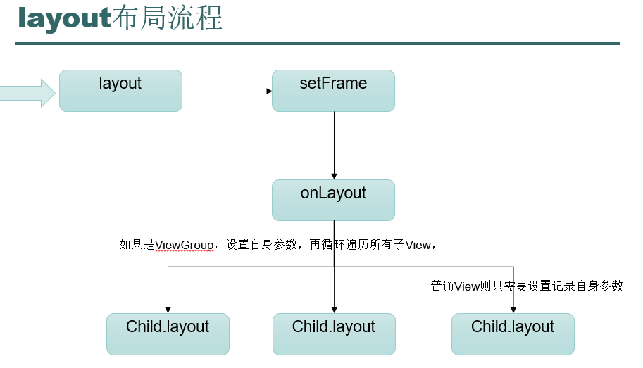

# 1 Layout流程

上篇笔记已经对view树的遍历和measure进行了讲解，但是我们也知道，view需要显示出来，需要进行三大步骤，这第二大不步骤就是layout了，layout用来确定子view的位置。


layout方法也是从ViewRoot中发起的，2.3源码如下：

    host.layout(0, 0, host.mMeasuredWidth, host.mMeasuredHeight);

在遍历测量完毕之后，就是执行遍历布局了




---
<br/><br/>

# 2 Layout源码分析

**来看一下layout的源码**

Layout方法中接受四个参数，是由父View提供，指定了子View在父View中的左、上、右、下的位置。父View在指定子View的位置时通常会根据子View在measure中测量的大小来决定。


    public final void layout(int l, int t, int r, int b) {
    //通过setFrame判断是否参数改变了
            boolean changed = setFrame(l, t, r, b);
    //如果改变了，或者mPrivateFlags被修改为必须进行重新布局则进行布局
            if (changed || (mPrivateFlags & LAYOUT_REQUIRED) == LAYOUT_REQUIRED) {
                if (ViewDebug.TRACE_HIERARCHY) {
                    ViewDebug.trace(this, ViewDebug.HierarchyTraceType.ON_LAYOUT);
                }
                 //重新布局
                onLayout(changed, l, t, r, b);
                //重新恢复标志
                mPrivateFlags &= ~LAYOUT_REQUIRED;
            }
            mPrivateFlags &= ~FORCE_LAYOUT;
        }


**setFrame方法源码**

1. setFrame方法是一个隐藏方法，所以作为应用层程序员来说，无法重写该方法。该方法体内部通过比对本次的l、t、r、b四个值与上次是否相同来判断自身的位置和大小是否发生了改变。
2. 如果发生了改变，将会调用invalidate请求重绘。
3. 记录本次的l、t、r、b，用于下次比对。
4. 如果大小发生了变化，onSizeChanged方法，该方法在大多数View中都是空实现，程序员可以重写该方法用于监听View大小发生变化的事件，在可以滚动的视图中重载了该方法，用于重新根据大小计算出需要滚动的值，以便显示之前显示的区域。


```java
       protected boolean setFrame(int left, int top, int right, int bottom) {
       //一个临时变量，记录范围是否发送变化
            boolean changed = false;
           ......
           //分别对l.t.r.b进行比较，只要有一个变化了，就说明范围发送变化
            if (mLeft != left || mRight != right || mTop != top || mBottom != bottom) {
                changed = true;
                // Remember our drawn bit
                int drawn = mPrivateFlags & DRAWN;
                // Invalidate our old position
                invalidate();
                //计算尺寸
                int oldWidth = mRight - mLeft;
                int oldHeight = mBottom - mTop;
                //记录新的尺寸
                mLeft = left;
                mTop = top;
                mRight = right;
                mBottom = bottom;

                mPrivateFlags |= HAS_BOUNDS;

                int newWidth = right - left;
                int newHeight = bottom - top;
                //如果view的尺寸变化了会回调onSizeChanged
                if (newWidth != oldWidth || newHeight != oldHeight) {
                    onSizeChanged(newWidth, newHeight, oldWidth, oldHeight);
                }
                //如果view是可见的，需要进行重绘
                if ((mViewFlags & VISIBILITY_MASK) == VISIBLE) {
                    // If we are visible, force the DRAWN bit to on so that
                    // this invalidate will go through (at least to our parent).
                    // This is because someone may have invalidated this view
                    // before this call to setFrame came in, therby clearing
                    // the DRAWN bit.
                    mPrivateFlags |= DRAWN;
                    invalidate();
                }

                // Reset drawn bit to original value (invalidate turns it off)
                mPrivateFlags |= drawn;
                mBackgroundSizeChanged = true;
            }
            //返回结果
            return changed;
        }
```

### layout后可以确定的变量

在调用了View的layout方法后，也就确定了View的位置了，View的最终宽高度也就确定了，为什么是最终宽高度呢？那测量的宽高又算什么呢？，这里需要了解的是，测量只是来计算View的需要的宽高度，用来给layout做参考，而最终确定View的位置和宽高的方法却是layout，

如下面只有在layout之后，mTop，mBottom,mRight,mLeft才能确定

        public final int getTop() {
            return mTop;
        }

       public final int getBottom() {
            return mBottom;
        }

       public final int getLeft() {
            return mLeft;
        }

       public final int getRight() {
            return mRight;
        }

在看一下获取View的宽高：

     public final int getHeight() {
            return mBottom - mTop;
        }

      public final int getWidth() {
            return mRight - mLeft;
        }

很明显就是一个减法计算，可以看到View的实际宽高确实是在layout后才确定的，那么`getHeight`，`getWidth`和`getMeasuredWidth`，`getMeasuredHeight`又有什么区别呢？

看一下源码：

    public final int getMeasuredWidth() {
            return mMeasuredWidth;
    }
     public final int getMeasuredHeight() {
            return mMeasuredHeight;
    }
返回的是设置的测量宽高，也就是说如果ViewGroup的layout流程遵循在测量中设置的测量尺寸，那么`getHeight`，`getWidth`和`getMeasuredWidth`，`getMeasuredHeight`没有任何区别，返回值必然是一样的，否则不一样！

---
<br/><br/>


# 3 ViewGroup如何进行layout
ViewGroup的onLayout是一个抽象方法，也就是说我们如果自定义ViewGroup必然要重写此方法，具体如何进行layout要根据界面需求，根本没有统一的标准

只是在layout过程中，一定要考虑好子view的margin和自身的padding

---
<br/><br/>

# 4 如何在Actiivty启动的时候准确的获取View的宽高

之前的源码分析中我们知道，View树真正遍历的执行实在ActivityThread的handleResumeActivity方法的最后，

      final void handleResumeActivity(IBinder token, boolean clearHide, boolean isForward) {

        ......
       //这里回调onStart ， onResume
        ActivityClientRecord r = performResumeActivity(token, clearHide);
        ......
        if (r.activity.mVisibleFromClient) {
          //View树构建完毕，真正开始遍历
           r.activity.makeVisible();
        }

    }

也就是说我们在onCreate，onStart，onRsume中调用View的`getHeight`，`getWidth`和`getMeasuredWidth`，`getMeasuredHeight`返回的都会是0


那么有什么办法呢？

#### 方法1：Activity的onWindowFocusChanged

Activity的onWindowFocusChanged表示View已经初始化完毕了，宽高已经准备好了，需要注意的是Activity的onWindowFocusChanged会被调用多次，当Activity的窗口得到焦点和失去焦点均会被调用，具体的说就是当Activity继续执行和暂停时Activity的onWindowFocusChanged都会执行，即onMeasure和onPause，代码如下：

       @Override
        public void onWindowFocusChanged(boolean hasFocus) {
            if(hasFocus){
                int viewHeight = mPasswordEdit.getWidth();
                int viewWidth = mPasswordEdit.getHeight();
            }
        }


#### 方法2：View.post(Runable)

通过post可以把一个消息添加到消息队列的尾部，这时候View肯定也就初始化好了

     public void onCreate(Bundle icicle) {
            super.onCreae(icicle)

            mPasswordEdit.post(new Runnable() {
                @Override
                public void run() {
                    int viewHeight = mPasswordEdit.getWidth();
                    int viewWidth = mPasswordEdit.getHeight();
                }
            });
    }

#### 方法3：ViewTreeObserver
使用ViewTreeObserver的众多回调可以完成这个功能，比如使用OnGlobalLayoutListener这个接口，当View树的状态发生变化或者VIew树内部的View可见性发生变化时，onGlobalLayout方法将会被回调，需要注意的是伴随着View的状态变化等，onGlobalLayout会被调用多次：

    mMultiStateView.getViewTreeObserver().addOnGlobalLayoutListener(new OnGlobalLayoutListener() {

                @SuppressWarnings("deprecation")
                @SuppressLint("NewApi")
                @Override
                public void onGlobalLayout() {
                    if(Build.VERSION.SDK_INT >= 16){
                        mMultiStateView.getViewTreeObserver().removeOnGlobalLayoutListener(this);
                    }else{
                        mMultiStateView.getViewTreeObserver().removeGlobalOnLayoutListener(this);
                    }
                    //获取宽高
                }
            });


#### 4：View.measure(w , h)

通过手动调用view的measure方法来得到宽高，这种方法比较复杂，需要分类讨论：

根据View的LayoutParams的宽高值来分：

**1，MATCH_PARENT**

直接放弃，因为父容器的宽高也不确定

**2，具体数值(dp/px)**

直接获取即可

**3，WRAW_CONTENT**

        int size = 1 << 30 -1;//即后30位
            int measureSpcec = MeasureSpec.makeMeasureSpec(size, MeasureSpec.AT_MOST);
            mMultiStateView.measure(
                    measureSpcec
                    , measureSpcec);
