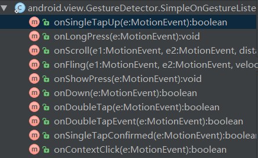

##GestureDetectory    
GestureDetector用来检测手势，支持很多手势操作，使用很简单，代码如下：

        mGestureDetector = new GestureDetector(getContext(), new GestureDetector.SimpleOnGestureListener() {

            });
            //如果需要拖动，设置此方法
            mGestureDetector.setIsLongpressEnabled(false);

       @Override
        public boolean onTouchEvent(MotionEvent event) {
    //事件交给mGestureDetector处理
            mGestureDetector.onTouchEvent(event);
            return super.onTouchEvent(event);
        }

通知适配器SimpleOnGestureListener，我们可以监听下面所示的所有手势：

这些手势说明如下：

|  方法名 | 描述  |
| ------------ | ------------ |
| onDown  | 手指轻触屏幕的一瞬间，由一个ACTION_DOWN事件触发  |
| onShowPress  | 手指轻触屏幕，没有松开或者拖动，由一个ACTION_DOWN事件触发与onDown的区别是，它强调没有松开或者拖动的状态 |
| onSingleTapUp  |  手指轻轻触摸屏幕后松开，伴随着一个ACTION_UP触发，这是个单击事件 |
| onScroll  | 手指按下屏幕，并且拖动，有一个ACTION_DOWN和多个ACTION_MOVE触发，这是拖动行为  |
|  onLongPress | 长按屏幕不放  |
|  onFling |  手指按下屏幕，快速拖动屏幕后松开，有一个甩的动作 |
|  onDoubleTap | 双击，由两个连续的单击事件组成  |
| onSingleTopConfirmed  | 严格的单击行为，和onSingleTapUp的区别是，onSingleTopConfirmed事件，后面不可能在紧跟着一个单击行为，即这只是一个单击行为，不可能是双击行为中的一次单击，即不可能与onDoubleTap共存|
|  onDoubleTapEvent | 表示发生了双击行为，在双击期间，ACTION_DOWN,ACTION_MOVE,ACTION_UP,都会触发此回调  |
