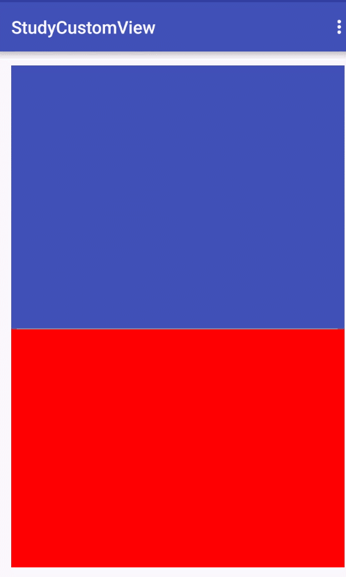
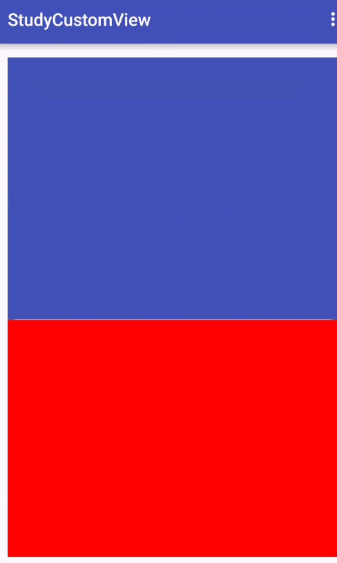
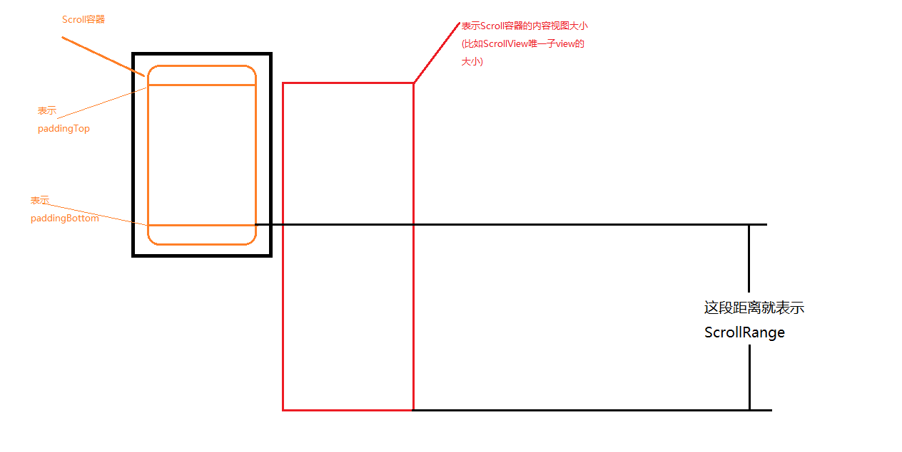

# 内容

之前已经对事件分发和MotionEvent进行了学习，但是之前的只是只能简单的实现手指拖动View的效果，而如果希望实现想ListView等可以滚动的控件的话，我们还需要学习下面的知识点。

- Scroller 用于实现滑动
- OverScroller Scroller的加强版，可以实现OverScroller
- VelocityTracker 速率跟踪器

   

# 1 Scroller与VelocityTracker

Scroller用于实现滑动和fling效果，但是其本身并没有滑动的功能，它只是帮助对需要实现的滑动效果进行计算。下面学习怎么使用Scroller。

### Scroll
比如一个这样的场景，当我们拖动一个View话滑动一段距离后松手，希望这个View自己滑动回到原来的位置。

效果：

首先我们需要实现拖动的逻辑，然后在手指松开的时候，使用Scroller计算，计算的是在指定时间内从拖动位置滑动回到原始位置的这一系列动作中，View在这个时间段内每一个时刻的位置，主要的代码如下：

        @Override
        public boolean onTouchEvent(MotionEvent ev) {
            int x = (int) ev.getX();
            int y = (int) ev.getY();

            int actionMask = ev.getAction();

            switch (actionMask) {
                case MotionEvent.ACTION_DOWN: {
                    break;
                }
                case MotionEvent.ACTION_MOVE: {
                    int dx = mLastX - x;
                    int dy = mLastY - y;
                    scrollBy(0, dy);
                    mLastX = x;
                    mLastY = y;
                    break;
                }
                case MotionEvent.ACTION_CANCEL:
                case MotionEvent.ACTION_UP: {
                    isBeginDrag = false;
                    scrollBack();
                    break;
                }
            }
            return true;
        }

       private void scrollBack() {
            mScroller.startScroll(
                    0,//x的起始位置
                    getScrollY(),/y的起始位置
                    0,//x方向上需要滑动的距离
                    0 - getScrollY(),//y方向上需要滑动的距离
                    300//这个滑动动作执行的时间
            );
            invalidate();//调用invalidate会导致computeScroll的执行
        }

        @Override
        public void computeScroll() {
            if (mScroller.computeScrollOffset()) {//调用computeScrollOffset计算此时刻的位置
               //获取当前需要滑动到的位置
                int currX = mScroller.getCurrX();
                int currY = mScroller.getCurrY();
                //执行滑动
                scrollTo(0, currY);
                invalidate();//反复调用invalidate，直到滑动结束
            }
        }

主要的代码都在上面，需要注意的是：
- startScroll 方法的参数
- 调用startScroll后必须调用invalidate
- 覆写computeScroll，只要computeScrollOffset方法返回true就不断的调用invalidate。

invalidate会导致View的重绘，而在重绘过程中computeScroll会被调用，默认它是一个空实现，主要的作用就是用来实现滑动，具体是如何调用的，可以看看源码。

### Fling

 当手指快速划过屏幕，然后快速立刻屏幕时，系统会判定用户执行了一个Fling手势。这个Fling的手势应用非常广泛，比如实现类似ScrollView的快速拖动后还会惯性滑动一段距离，还有ViewPager的Fling翻页等，而实现Fling需要借助一个类`VelocityTracker`来计算用户手指滑过屏幕的速度。下面通过一个例子来学习如何实现Fling

比如下面效果：

可能效果不是很明显，但是我的手指只是快速的划了一个屏幕就松开了，剩下的惯性滑动都是依靠Scroller的fing完成的，

主要的代码如下：

      private VelocityTracker mVelocityTracker;
      private int mScaledMinimumFlingVelocity;
      private int mScaledMaximumFlingVelocity;

     private void init() {
            mScaledTouchSlop = ViewConfiguration.get(getContext()).getScaledTouchSlop();
            mScaledMinimumFlingVelocity = ViewConfiguration.get(getContext()).getScaledMinimumFlingVelocity();
            mScaledMaximumFlingVelocity = ViewConfiguration.get(getContext()).getScaledMaximumFlingVelocity();
            mVelocityTracker = VelocityTracker.obtain();
            mScroller = new Scroller(getContext());
        }

       @Override
        public boolean onTouchEvent(MotionEvent ev) {
            int x = (int) ev.getX();
            int y = (int) ev.getY();
            //把事件交给mVelocityTracker分析
            mVelocityTracker.addMovement(ev);
            int actionMask = ev.getAction();

            switch (actionMask) {
                case MotionEvent.ACTION_DOWN: {
                    break;
                }
                case MotionEvent.ACTION_MOVE: {
                    int dx = mLastX - x;
                    int dy = mLastY - y;
                    scrollBy(0, dy);
                    mLastX = x;
                    mLastY = y;
                    break;
                }
                case MotionEvent.ACTION_CANCEL:
                case MotionEvent.ACTION_UP: {
                    isBeginDrag = false;
                    //使用mVelocityTracker来计算速度，
                    //计算当前速度， 1代表px/毫秒, 1000代表px/秒,
                        mVelocityTracker.computeCurrentVelocity(1000,mScaledMaximumFlingVelocity);
                        float yVelocity = mVelocityTracker.getYVelocity();
                        mVelocityTracker.clear();
                        if (Math.abs(yVelocity) > mScaledMinimumFlingVelocity) {
                            fling(-yVelocity);//根据坐标轴正方向问题，这里需要加上-号
                        }

                    break;

                }
            }
            return true;
        }

      private void fling(float v) {
            mScroller.fling(
                    getScrollX(),//起始x位置
                    getScrollY(),//起始y位置
                    0, (int) v,//x加速度，y加速度
                    0, 0,//  x方向fling的范围
                    0, 1000);// y方向fling的范围
            invalidate();
        }

       @Override
        public void computeScroll() {
            if (mScroller.computeScrollOffset()) {
                int currX = mScroller.getCurrX();
                int currY = mScroller.getCurrY();
                scrollTo(0, currY);
                invalidate();
            }
        }

可能自重最难理解的就是fling方法的后四个参数，我们就以`y方向fling的范围`来说明参数表达的具体含义。

- minY 表示fling的目标值不能小于的数值
- maxY 表示fling的目标值不能超过的数值

比如当我的当前y是1000，然后速率是-1000，当启动一个fling后，y必然会慢慢的减少，但是y不能少于我指定的minY值。

比如当我的当前y是0，然后速率是1000，当启动一个fling后，y必然会慢慢的增加，但是y不能大于我指定的maxY值。

## VelocityTracker说明：
VelocityTracker的使用，刚刚已经贴出了相关代码，

用VelocityTracker的静态方法`obtion`可以得到一个VelocityTracker实例，然后在一系列事件分发中不断的吧MotionEvent传递给VelocityTracker进行分析，最后通过computeCurrentVelocity方法计算x和y方向上的速率，当计算完一次速率后应该调用其clear方法清除之前的状态，而不再需要时应该调用VelocityTracker的recycler把实例放入回收池中。

computeCurrentVelocity(int units)说明：其中units是单位表示， 1代表px/毫秒, 1000代表1000px/秒。

在使用VelocityTracker获取到速率后，应该使用ViewConfiguration的getScaledMinimumFlingVelocity方法的返回值做对比，当数据大于这个值时才应该算作是一个fling动作。

   

# OverScroll

OverScroll用于实现类似ios的滑动，在滑到边缘时依然可以滑动，松开手后自动回到开始的位置，在Android中实现这个也是比较容易的，主要涉及到的方法如下：

### View的overScrollBy方法

    protected boolean overScrollBy(int deltaX, int deltaY,
                int scrollX, int scrollY,
                int scrollRangeX, int scrollRangeY,
                int maxOverScrollX, int maxOverScrollY,
                boolean isTouchEvent)

对参数做一下说明：

- deltaX和deltaY 分别是需要滑动的距离
- scrollX和scrollY 是当前的scroll值
- scrollRangeX和scrollRangeY 标识可以滑动的范围(看下面图)
- maxOverScrollX，maxOverScrollY 表示可以overScroll的值，根据需求来设置，如果我们把maxOverScrollY设置为100，那么在滑动到上边缘后，这个View还可以继续向下滑动100，下边缘也是类似的效果。
- isTouchEvent 表示是否是应为出触摸触发的overscroll，如果在onTouch中调用，那么久是true，如果是在computeScroll就是false。

###  View的onOverScrolled方法
当调用overScrollBy是，overScrollBy内部会进行一些计算然后调用onOverScrolled，而我们需要在onOverScrolled中完成内容的滑动。

    onOverScrolled(int scrollX, int scrollY, boolean clampedX, boolean clampedY) {}

- scrollX/scrollY表示需要scrollTo的x/y位置
- clampedX/clampedY表示是否已经OverScroll到最大值，如果已经OverScroll到最大值应该调用OverScroll的springBack方法回弹到原来的位置。

### OverScroll的springBack方法和

     public boolean springBack(int startX, int startY, int minX, int maxX, int minY, int maxY)

参数说明：
- startX/startY 当前的scroll值
- minX/minY 传入0即可
- maxX/maxY 传人滑动范围值

### OverScroll的fling方法
OverScroll的fling方法中有一个八个参数的重载方法，用于实现OverScroll:

    public void fling(int startX, int startY, int velocityX, int velocityY,
                int minX, int maxX, int minY, int maxY, int overX, int overY) {

只是最后添加了两个参数overX和overY，这两个参数和overScrollBy方法的overScroll参数是一样的意思，就不再多说了。

### EdgeEffect
EdgeEffect用于实现边缘拖动的发光效果，具体可以参考系统的ScrollView。

## Demo

下面是一个例子(很多都是参考系统的ScrollView)，实现了拖动OverScroll和Fling的OverScroll：

    public class OverScrollerView extends LinearLayout {

        private static final String TAG = OverScrollerView.class.getSimpleName();
        private OverScroller mOverScroller;
        private int mScaledTouchSlop;
        private int mScaledMaximumFlingVelocity;
        private int mScaledMinimumFlingVelocity;

        private VelocityTracker mVelocityTracker;

        private boolean mIsBeginDrag;

        private int mActivePointerId;

        private int mDownX, mDownY;
        private int mLastX, mLastY;
        private int mOverscrollDistance = 200;

        public OverScrollerView(Context context) {
            this(context, null);
        }

        public OverScrollerView(Context context, AttributeSet attrs) {
            this(context, attrs, 0);
        }

        public OverScrollerView(Context context, AttributeSet attrs, int defStyleAttr) {
            super(context, attrs, defStyleAttr);
            setOrientation(VERTICAL);
            setOverScrollMode(OVER_SCROLL_ALWAYS);
            init();
        }

        private void init() {
            mOverScroller = new OverScroller(getContext());
            ViewConfiguration viewConfiguration = ViewConfiguration.get(getContext());
            mScaledTouchSlop = viewConfiguration.getScaledTouchSlop();
            mScaledMinimumFlingVelocity = viewConfiguration.getScaledMinimumFlingVelocity();
            mScaledMaximumFlingVelocity = viewConfiguration.getScaledMaximumFlingVelocity();
            mOverscrollDistance = viewConfiguration.getScaledOverscrollDistance();
            mVelocityTracker = VelocityTracker.obtain();
            mOverscrollDistance = 300;
            Log.d(TAG, "mOverscrollDistance:" + mOverscrollDistance);
        }

        @Override
        public boolean onInterceptHoverEvent(MotionEvent event) {

            int actionMasked = MotionEventCompat.getActionMasked(event);

            if ((actionMasked == MotionEvent.ACTION_MOVE) && (mIsBeginDrag)) {
                return true;
            }

            switch (actionMasked) {
                case MotionEvent.ACTION_DOWN: {
                    if (mOverScroller.isOverScrolled()) {
                        mIsBeginDrag = true;
                        mOverScroller.abortAnimation();
                    } else {
                        mIsBeginDrag = false;
                    }
                    int index = event.getActionIndex();
                    mActivePointerId = event.getPointerId(index);
                    mDownX = (int) MotionEventCompat.getX(event, index);
                    mDownY = (int) MotionEventCompat.getY(event, index);
                    mLastX = mDownX;
                    mLastY = mDownY;
                    break;
                }
                case MotionEventCompat.ACTION_POINTER_DOWN: {
                    onSecondPointerDown(event);
                    break;
                }
                case MotionEvent.ACTION_MOVE: {

                    if (mActivePointerId == MotionEvent.INVALID_POINTER_ID) {
                        return false;
                    }
                    int pointerIndex = MotionEventCompat.findPointerIndex(event, mActivePointerId);
                    if (pointerIndex < 0) {
                        return false;
                    }

                    int currentX = (int) MotionEventCompat.getX(event, pointerIndex);
                    int currentY = (int) MotionEventCompat.getY(event, pointerIndex);
                    int dx = mLastX - currentX;
                    int dy = mLastY - currentY;

                    if (Math.abs(dx) > mScaledTouchSlop || Math.abs(dy) > mScaledTouchSlop) {
                        mIsBeginDrag = true;
                        mLastX = currentX;
                        mLastY = currentY;
                    }

                    break;
                }
                case MotionEvent.ACTION_CANCEL:
                case MotionEvent.ACTION_UP: {
                    mIsBeginDrag = false;
                    break;
                }
                case MotionEventCompat.ACTION_POINTER_UP: {
                    onSecondPointerUp(event);
                    break;
                }
            }

            return mIsBeginDrag;
        }

        @Override
        public boolean onTouchEvent(MotionEvent event) {
            int actionMasked = MotionEventCompat.getActionMasked(event);
            mVelocityTracker.addMovement(event);

            switch (actionMasked) {
                case MotionEvent.ACTION_DOWN: {
                    if ((mIsBeginDrag = !mOverScroller.isFinished())) {
                        mOverScroller.abortAnimation();
                    }
                    int index = event.getActionIndex();
                    mActivePointerId = event.getPointerId(index);
                    mLastX = (int) MotionEventCompat.getX(event, index);
                    mLastY = (int) MotionEventCompat.getY(event, index);
                    break;
                }
                case MotionEventCompat.ACTION_POINTER_DOWN: {
                    onSecondPointerDown(event);
                    break;
                }
                case MotionEvent.ACTION_MOVE: {
                    if (mActivePointerId == MotionEvent.INVALID_POINTER_ID) {
                        return false;
                    }
                    int pointerIndex = MotionEventCompat.findPointerIndex(event, mActivePointerId);
                    if (pointerIndex < 0) {
                        return false;
                    }
                    int currentX = (int) MotionEventCompat.getX(event, pointerIndex);
                    int currentY = (int) MotionEventCompat.getY(event, pointerIndex);
                    int dx = mLastX - currentX;
                    int dy = mLastY - currentY;
                    if (!mIsBeginDrag && Math.abs(dx) > mScaledTouchSlop || Math.abs(dy) > mScaledTouchSlop) {
                        mIsBeginDrag = true;
                        if (dy > 0) {
                            dy -= mScaledTouchSlop;
                        } else {
                            dy += mScaledTouchSlop;
                        }

                        if (dx > 0) {
                            dx -= mScaledTouchSlop;
                        } else {
                            dx += mScaledTouchSlop;
                        }
                    }

                    if (mIsBeginDrag) {
                        boolean b = overScrollBy(dx, dy, getScrollX(), getScrollY(), 0, getScrollRange(), 0, mOverscrollDistance, true);
                        mLastX = currentX;
                        mLastY = currentY;
                    }
                    break;
                }
                case MotionEventCompat.ACTION_POINTER_UP: {
                    onSecondPointerUp(event);

                    break;
                }
                case MotionEvent.ACTION_CANCEL:
                case MotionEvent.ACTION_UP: {
                    mIsBeginDrag = false;
                    int index = MotionEventCompat.findPointerIndex(event, mActivePointerId);
                    mVelocityTracker.computeCurrentVelocity(1000, mScaledMaximumFlingVelocity);
                    float yVelocity = mVelocityTracker.getYVelocity(index);
                    if (Math.abs(yVelocity) > mScaledMinimumFlingVelocity) {
                        Log.d(TAG, "onTouchEvent() called with: " + "doFling");
                        doFling(-yVelocity);
                    } else if (mOverScroller.springBack(getScrollX(), getScrollY(), 0, 0, 0, getScrollRange())) {
                        Log.d(TAG, "onTouchEvent() called with: " + "springBack");
                        ViewCompat.postInvalidateOnAnimation(this);
                    }
                    mVelocityTracker.clear();
                    mActivePointerId = MotionEvent.INVALID_POINTER_ID;
                    break;
                }
            }

            return true;
        }

        private void doFling(float v) {
            Log.d(TAG + "DD", "yVelocity:" + v);
            mOverScroller.fling(
                    getScrollX(),
                    getScrollY(),
                    0, (int) v,
                    0, 0,
                    0, getScrollRange(),
                    0, mOverscrollDistance
            );
            ViewCompat.postInvalidateOnAnimation(this);
        }

        private void onSecondPointerDown(MotionEvent event) {
            int index = MotionEventCompat.getActionIndex(event);
            mActivePointerId = MotionEventCompat.getPointerId(event, index);
            mLastX = (int) MotionEventCompat.getX(event, index);
            mLastY = (int) MotionEventCompat.getY(event, index);
        }

        private void onSecondPointerUp(MotionEvent event) {
            int index = MotionEventCompat.getActionIndex(event);
            int pointerId = MotionEventCompat.getPointerId(event, index);
            if (mActivePointerId == pointerId) {
                int newIndex = index == 0 ? 1 : 0;
                mLastX = (int) MotionEventCompat.getX(event, newIndex);
                mLastY = (int) MotionEventCompat.getY(event, newIndex);
                mActivePointerId = MotionEventCompat.getPointerId(event, newIndex);
            }
        }

        private int getScrollRange() {
            int scrollRange = 0;
            int childCount = getChildCount();
            if (childCount > 0) {
                View child = getChildAt(childCount - 1);
                scrollRange = Math.max(0,
                        child.getBottom() - (getHeight() - getPaddingBottom() - getPaddingTop()));
            }
            return scrollRange;
        }

        @Override
        public void computeScroll() {
            if (mOverScroller.computeScrollOffset()) {
                int oldX = getScrollX();
                int oldY = getScrollY();
                int x = mOverScroller.getCurrX();
                int y = mOverScroller.getCurrY();
                if (oldX != x || oldY != y) {
                    final int range = getScrollRange();
                    int dx = x - oldX;
                    int dy = y - oldY;
                    overScrollBy(dx, dy, oldX, oldY, 0, range,
                            0, mOverscrollDistance, false);
                    onScrollChanged(getScrollX(), getScrollY(), oldX, oldY);
                }

                ViewCompat.postInvalidateOnAnimation(this);
            }
        }

        @Override
        protected void onOverScrolled(int scrollX, int scrollY, boolean clampedX, boolean clampedY) {
            Log.d(TAG, "mOverScroller.isFinished():" + mOverScroller.isFinished());
            if (!mOverScroller.isFinished()) {
                super.scrollTo(scrollX, scrollY);
                if (clampedX || clampedY) {
                    mOverScroller.springBack(this.getScrollX(), this.getScrollY(), 0, 0, 0, 0);
                    Log.d(TAG, "onOverScrolled-->springBack");
                }
            } else {
                super.scrollTo(scrollX, scrollY);
            }
        }
    }
