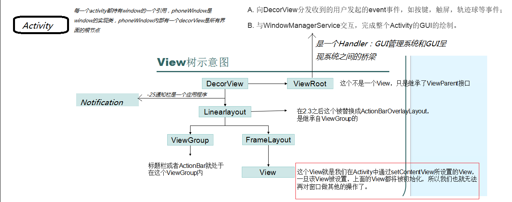
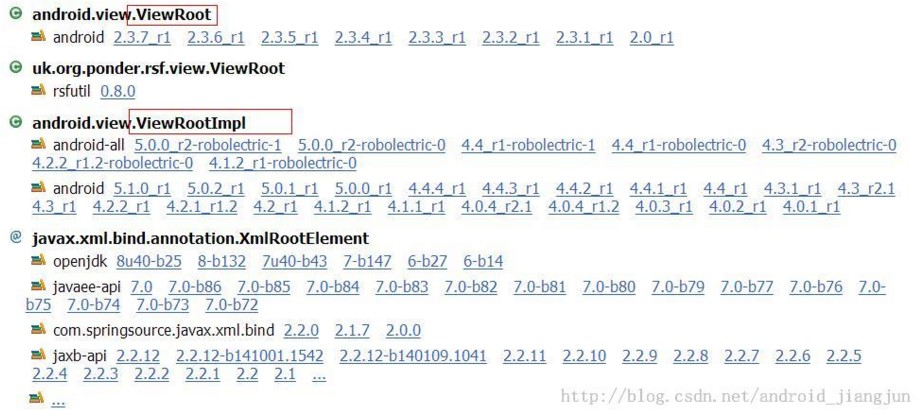

#内容


内容：

- invalidate 方法分析
- requestLayout方法分析
- rootView初始化及与DecorView进行管理，并添加到WindowManager分析
- performTraversals简要分析
- Activity-ViewRoot-Window-WindowManager关系简要分析


---
<br/><br/><br/>


# 1 View的绘制流程-什么时候发起绘制以及发起的绘制流程分析


前面说到在PhoneWindow中，调用setContentView，然后解析xml布局(如果传参的xmlId的话)，从而完成整个View树的创建

但是只是创建了View树，并没有执行View树的遍历操作，也就不会执行测量，布局，绘制等操作，这样视图还是无法显示出来，那么View树的遍历是从哪里开始的呢？

前面说过是在ViewRoot.java类中 performTraversals（）函数发起的，那么这个函数又是被谁调用的呢？下面开始分析


## 1.1  引起View树重新绘制的方
首先能够引起View树重新绘制的方法有：

- 1，invalidate()方法 ：

    请求重绘View树，即draw()过程，假如视图发生大小没有变化就不会调用layout()过程，
    并且只绘制那些“需要重绘的”视图，即谁(View的话，只绘制该View ；ViewGroup，
    则绘制整个ViewGroup)请求invalidate()方法，就绘制该视图。

     一般引起invalidate()操作的函数如下：
 - 1、直接调用invalidate()方法，请求重新draw()，但只会绘制调用者本身。
 - 2、setSelection()方法 ：请求重新draw()，但只会绘制调用者本身。
 - 3、setVisibility()方法 ： 当View可视状态在INVISIBLE转换VISIBLE时，会间接调用invalidate()方法， 继而绘制该View。
 - 4 、setEnabled()方法 ： 请求重新draw()，但不会重新绘制任何视图包括该调用者本身。

- 2，requestLayout()方法 ：

    会导致调用measure()过程 和 layout()过程 。
    说明：只是对View树重新布局layout过程包括measure()和layout()过程，不会调用draw()过程，不会重新绘制任何视图包括该调用者本身。

    一般引起requestLayout()操作的函数如setVisibility()方法，当View的可视状态在INVISIBLE/ VISIBLE 转换为GONE状态时，会间接调用requestLayout() 和invalidate方法，同时，由于整个个View树大小发生了变化，会请求measure()过程以及draw()过程，同样地，只绘制需要“重新绘制”的视图。

- 3，requestFocus()方法：

请求View树的draw()过程，但只绘制“需要重绘”的视图。

具体可以参考《安卓内核剖析：第十三章View工作原理》


接下来分析这些方法：

invalidate方法用的比较多，当一个View的内容放生变化时，我们就会调用这个方法，然后其View的onDraw方法就会被调用，从而重新绘制View的内容，那么其内部的调用过程是怎样的呢？

## 1.2 invalidate方法分析

invalidate方法在View中实现如下：

        //只能在UI Thread中使用，别的Thread用postInvalidate方法，View是可见的才有效，回调onDraw方法，针对整个View
        public void invalidate() {
            invalidate(true);
        }
        //default的权限，只能在UI Thread中使用，别的Thread用postInvalidate方法，View是可见的才有效，回调onDraw方法，针对整个View
        void invalidate(boolean invalidateCache) {
            invalidateInternal(0, 0, mRight - mLeft, mBottom - mTop, invalidateCache, true);
        }


        //只能在UI Thread中使用，别的Thread用postInvalidate方法，View是可见的才有效，回调onDraw方法，针对局部View
        public  void  invalidate(int l, int t, int r, int b){......}

      //实质还是调运invalidateInternal方法
      void invalidateInternal(int l, int t, int r, int b, boolean invalidateCache,
                boolean fullInvalidate) {
                ......

                if (skipInvalidate()) {//是否跳过Invalidate
                       return;
                }

     if ((mPrivateFlags & (PFLAG_DRAWN | PFLAG_HAS_BOUNDS)) == (PFLAG_DRAWN | PFLAG_HAS_BOUNDS)
                    || (invalidateCache && (mPrivateFlags & PFLAG_DRAWING_CACHE_VALID) == PFLAG_DRAWING_CACHE_VALID)
                    || (mPrivateFlags & PFLAG_INVALIDATED) != PFLAG_INVALIDATED
                    || (fullInvalidate && isOpaque() != mLastIsOpaque)) {
                if (fullInvalidate) {
                    mLastIsOpaque = isOpaque();
                    mPrivateFlags &= ~PFLAG_DRAWN;
                }
                //这里修改了PFLAG_DIRTY标志
                mPrivateFlags |= PFLAG_DIRTY;


                // 计算重绘的区域，然后调用父节点的invalidateChild方法
                final AttachInfo ai = mAttachInfo;
                final ViewParent p = mParent;
                if (p != null && ai != null && l < r && t < b) {
                    final Rect damage = ai.mTmpInvalRect;
                    //设置刷新区域
                    damage.set(l, t, r, b);
                    //调用父View的invalidateChild方法
                    p.invalidateChild(this, damage);
                }
                ......
        }


需要注意的是skipInvalidate()方法：如果满足下面方法条件，就会导致invalidate方法无效

       /**
         * 不可见的或者是没有执行动画的view或者没有Transitioning将不会被绘制，这些view将不会被设置ditry_flag
         */
        private boolean skipInvalidate() {
            return (mViewFlags & VISIBILITY_MASK) != VISIBLE && mCurrentAnimation == null &&
                    (!(mParent instanceof ViewGroup) ||
                            !((ViewGroup) mParent).isViewTransitioning(this));
        }


上面分析总结如下：
>将要刷新区域直接传递给了父ViewGroup的invalidateChild方法，在invalidate中，调用父View的invalidateChild，这是一个从当前向上级父View回溯的过程，每一层的父View都将自己的显示区域与传入的刷新Rect做交集 。所以我们看下ViewGroup的invalidateChild方法，源码如下：


     public final void invalidateChild(View child, final Rect dirty) {
            ViewParent parent = this;

            ......省略代码

                do {
                   ......省略代码

                    parent = parent.invalidateChildInParent(location, dirty);
                    ......省略代码
                } while (parent != null);
            }
        }

这个过程就是不断的向上调用parent.invalidateChildInParent(location, dirty)方法。那么最终这个方法会向上执行到哪呢？DecorView？不是的，因为DecorView没有执行遍历的方法，继续分析：

首先View的mParent是如果被赋值的？


    void assignParent(ViewParent parent) {
            if (mParent == null) {
                mParent = parent;
            } else if (parent == null) {
                mParent = null;
            } else {
                throw new RuntimeException("view " + this + " being added, but"
                        + " it already has a parent");
            }
        }


assignParent是在什么时候被调用的?

1,当一个View被添加到一个ViewGroup时：

        public void addView(View child, int index, LayoutParams params) {
          ......

            // addViewInner() will call child.requestLayout() when setting the new LayoutParams
            // therefore, we call requestLayout() on ourselves before, so that the child's request
            // will be blocked at our level
            requestLayout();
            invalidate(true);
            addViewInner(child, index, params, false);
        }


addViewInner     

      private void addViewInner(View child, int index, LayoutParams params,
                boolean preventRequestLayout) {

          ......

            // tell our children
            if (preventRequestLayout) {
                child.assignParent(this);
            }

     }

2,但是Decor作为一个View树的跟布局，肯定不可能被添加到ViewGroup中，那么它的mParent是谁呢？答案是ViewRoot(稍后分析ViewRoot是怎么赋值给mParent的)，下面ViewRoot一段代码也可以说明：

       public void invalidateChild(View child, Rect dirty) {
            checkThread();
            ......
            if (!mWillDrawSoon) {
                scheduleTraversals();
            }
        }


        public ViewParent invalidateChildInParent(final int[] location, final Rect dirty) {
              invalidateChild(null, dirty);
        return null;
    }

        public ViewParent getParent() {
            return null;
        }

1，checkThread，如果不是UI线程调用，直接抛出异常(同时也说明，在DecorView的mParent被赋值之前，是可以在子线程中操作ui的)

2，invalidateChildInParent调用invalidateChild，然后调用scheduleTraversals();执行遍历

3，getParent()返回null，上面invalidateChild方法中的循环结束


然后调用scheduleTraversals的逻辑比较复杂，他是整个View树绘制的起点，稍后分析


## 1.3 DecorView的mParent被赋值过程、ViewRoot被创建过程与添加到WindowManager简单分析

现在的问题是ViewRoot是什么时候被赋值的？

熟悉Activity生命周期方法的都知道，Activity有如下方法：

onCreate
onStart
onResume
onPause
onStop
onDestory

其中onCreate表示Activity被创建，我们也在这里setContentView，onStart表示视图即将可见，onResume表示当前Activity已可以与用户进行交互，并且视图已经可见，所以可以从这里开始分析，

熟悉Activity架构的都应该知道，Activity的生命周期方法是否ActivityManagerService通过Binder，ApplicationThread进行调用的，ApplicationThread通过H类发送消息到ActivityThread，进行Activity的各生命周期方法的操作与回调

onCreate表示Activity被创建，此时DecorView压根就没被创建，直接略过


onStart分析：代码中也没有相关逻辑

onResume方法：直接看handleResumeActivity

    final void handleResumeActivity(IBinder token, boolean clearHide, boolean isForward) {
           ......
                if (r.window == null && !a.mFinished && willBeVisible) {
                    r.window = r.activity.getWindow();
                    View decor = r.window.getDecorView();
                    decor.setVisibility(View.INVISIBLE);
                    ViewManager wm = a.getWindowManager();
                    WindowManager.LayoutParams l = r.window.getAttributes();
                    a.mDecor = decor;
                    l.type = WindowManager.LayoutParams.TYPE_BASE_APPLICATION;
                    l.softInputMode |= forwardBit;
                    if (a.mVisibleFromClient) {
                        a.mWindowAdded = true;
                        wm.addView(decor, l);
                    }

             ......
        }

可以看到有` wm.addView(decor, l);`这样一段逻辑，这个wm其实就是WindowManager，其实现类是WindowManagerImpl,addView的具体实现为：

     private void addView(View view, ViewGroup.LayoutParams params, boolean nest)
        {
            if (Config.LOGV) Log.v("WindowManager", "addView view=" + view);

            if (!(params instanceof WindowManager.LayoutParams)) {
                throw new IllegalArgumentException(
                        "Params must be WindowManager.LayoutParams");
            }

            final WindowManager.LayoutParams wparams
                    = (WindowManager.LayoutParams)params;

            ViewRoot root;
            View panelParentView = null;

            synchronized (this) {
                // notification gets updated.
                int index = findViewLocked(view, false);
                if (index >= 0) {
                    if (!nest) {
                        throw new IllegalStateException("View " + view
                                + " has already been added to the window manager.");
                    }
                    root = mRoots[index];
                    root.mAddNesting++;
                    // Update layout parameters.
                    view.setLayoutParams(wparams);
                    root.setLayoutParams(wparams, true);
                    return;
                }

                if (wparams.type >= WindowManager.LayoutParams.FIRST_SUB_WINDOW &&
                        wparams.type <= WindowManager.LayoutParams.LAST_SUB_WINDOW) {
                    final int count = mViews != null ? mViews.length : 0;
                    for (int i=0; i<count; i++) {
                        if (mRoots[i].mWindow.asBinder() == wparams.token) {
                            panelParentView = mViews[i];
                        }
                    }
                }

                root = new ViewRoot(view.getContext());
                root.mAddNesting = 1;

                view.setLayoutParams(wparams);

                if (mViews == null) {
                    index = 1;
                    mViews = new View[1];
                    mRoots = new ViewRoot[1];
                    mParams = new WindowManager.LayoutParams[1];
                } else {
                    index = mViews.length + 1;
                    Object[] old = mViews;
                    mViews = new View[index];
                    System.arraycopy(old, 0, mViews, 0, index-1);
                    old = mRoots;
                    mRoots = new ViewRoot[index];
                    System.arraycopy(old, 0, mRoots, 0, index-1);
                    old = mParams;
                    mParams = new WindowManager.LayoutParams[index];
                    System.arraycopy(old, 0, mParams, 0, index-1);
                }
                index--;

                mViews[index] = view;
                mRoots[index] = root;
                mParams[index] = wparams;
            }
            // do this last because it fires off messages to start doing things
            root.setView(view, wparams, panelParentView);
        }

可以明细的看到，ViewRoot就是在此处被初始化的，最后调用了` root.setView(view, wparams, panelParentView);`，

而在ViewRoot的setView中就调用了view的`view.assignParent(this);`方法，把DecorView的mParent设置为自己。

      public void setView(View view, WindowManager.LayoutParams attrs,
                View panelParentView) {
            synchronized (this) {
                   mAttachInfo.mRootView = view;
                    ......
                    mAdded = true;
                   .......
                    view.assignParent(this);
            }
    }

把DecorView和ViewRoot关联起来，添加到WindowManager后，在handleResumeActivity的最后又调用了当前Activity的activity.makeVisible()方法

         //调用onStart，onResume等方法后
        if (r.activity.mVisibleFromClient) {
                    r.activity.makeVisible();
                }


然后View树执行遍历操作，整个视图显示出来。


<br/>
---
**这里说一下ViewRoot的创建细节**：

首先从ViewRoot的构造函数说起：

    public ViewRoot(Context context) {
            super();

            if (MEASURE_LATENCY && lt == null) {
                lt = new LatencyTimer(100, 1000);
            }

            // For debug only
            //++sInstanceCount;

            // Initialize the statics when this class is first instantiated. This is
            // done here instead of in the static block because Zygote does not
            // allow the spawning of threads.
            getWindowSession(context.getMainLooper());

            mThread = Thread.currentThread();
            mLocation = new WindowLeaked(null);
            mLocation.fillInStackTrace();
            mWidth = -1;
            mHeight = -1;
            mDirty = new Rect();
            mTempRect = new Rect();
            mVisRect = new Rect();
            mWinFrame = new Rect();
            //初始化W，
            mWindow = new W(this, context);
            mInputMethodCallback = new InputMethodCallback(this);
            mViewVisibility = View.GONE;
            mTransparentRegion = new Region();
            mPreviousTransparentRegion = new Region();
            mFirst = true; // true for the first time the view is added
            mAdded = false;
            //初始化mAttachInfo sWindowSession是WindowManager服务的远程引用
            mAttachInfo = new View.AttachInfo(sWindowSession, mWindow, this, this);
            mViewConfiguration = ViewConfiguration.get(context);
            mDensity = context.getResources().getDisplayMetrics().densityDpi;
        }

构造函数初始化了一些对象，

- W是一个本地的Bidner，将会传递给WindowManagerService，
- AttachInfo ，表示一组View的信息，当一个View附加到一个Window上后，View的attachInfo被赋值
- sWindowSession是WindowManager服务的远程引用

然后是add

    res = sWindowSession.add(mWindow, mWindowAttributes,
                                getHostVisibility(), mAttachInfo.mContentInsets,
                                mInputChannel);


这里让客户端的mWindow与服务端的WidowManagerService产生关联，mWindow就是W，是一个Binder结构，传递给服务端后，服务端就可以主动调用客户端，这样也是双方都掌握着主动调用的跨进程通信方式

<br/>
<br/>

---


> **postInvalidate**方法与invalidate方法类似。只是它适合于在子线程调用。

###requestLayout方法分析：

和invalidate类似，其实在上面分析View绘制流程时或多或少都调运到了这个方法，而且这个方法对于View来说也比较重要，所以我们接下来分析一下他。如下View的requestLayout源码：

     public void requestLayout() {
            ......
            if (mParent != null && !mParent.isLayoutRequested()) {
                //由此向ViewParent请求布局
                //从这个View开始向上一直requestLayout，最终到达ViewRootImpl的requestLayout
                mParent.requestLayout();
            }
            ......
        }

其本质也是向上层层传递，直到ViewRootImpl为止，然后触发ViewRootImpl的requestLayout方法，如下就是ViewRoot的requestLayout方法：

    public void requestLayout() {
            checkThread();
            mLayoutRequested = true;
            scheduleTraversals();
        }


**至此View的绘制流程，什么时候发起绘制，以及发起绘制的流程分析完毕。**


总结：

1，View的一个简单架构图：




2，ViewRoot与ViewGroup都实现了ViewParent接口，ViewParent主要提供了一系列操作子View的方法例如焦点的切换，显示区域的控制等等。

3，ViewGroup和WindowManager都实现了ViewManager接口，ViewManager提供了三个抽象方法addView，removeView，updateViewLayout。用来添加、删除、更新布局。

可见ViewGroup作为一个View的容器，有添加删除子view的功能，也有控制子view焦点等功能，而ViewRoot则只需要控制子view焦点等功能，因为它不需要去控制子view的删除等操作，这都是decorView和其子容器的事，而WindowManager作为一个窗口当然也会有添加，删除view的功能，而控制子view焦点等功能则通过viewRoot去实现。

从以上可得，利用接口把复杂的逻辑按照职责区分，子类按照自己的职责任务去实现不同的接口，而在逻辑调用时，只需要通过接口去声明，偶尔性降低，职责明确后代码也很清晰，这就是所谓的面向接口编程吧！！！


---
<br/>

## 导致View树重新遍历的时机：
上面笔记说了：
- requestFocus
- invalidate
- requestLayout
都会导致View树的重新遍历，那么内部是什么机制呢？接着分析：

遍历View树意味着整个View需要重新对其包含的子视图分配大小并重绘。一般情况下导致遍历原因有三个：
- View本身内部状态发生变化，而引起重绘
- view树内部添加了或者删除了子view
- View本身的大小及可见性发生了变化

具体可以分为：
- View的状态发生变化 StateListDrawable
- refreshDrawableList
- onFocusedChanged
- serVisibility
- setEnable
- setSelected
- invalidate
- requestLayout
- requestFocused


具体可以参考《安卓内核剖析》十三章 View的工作原理


---
<br/>
<br/>
<br/>

# 2 View的绘制起点-performTraversals方法分析：


performTraversals方法太过复杂，具体的逻辑可以去查看源码，大概的流程如下：

### dispatchAttachedToWindow

判断是否是第一次初始化，如果是则做一些初始化操作

第一次attach到Window，通知所有子view，传递attachInfo对象
` host.dispatchAttachedToWindow(attachInfo, 0);`

### 测量

判断是否需要重新测量，需要则执行测量


      /**
      lp的定义：`WindowManager.LayoutParams lp = mWindowAttributes;`      
      */
     //初始化根View的测量规格
     childWidthMeasureSpec = getRootMeasureSpec(desiredWindowWidth, lp.width);
     childHeightMeasureSpec = getRootMeasureSpec(desiredWindowHeight, lp.height)
     //执行测量，后期的版本可能是preformMeasure
     host.measure(childWidthMeasureSpec, childHeightMeasureSpec);


这里可以看一下测量规格产生的方法：一般都是屏幕的宽高

    private int getRootMeasureSpec(int windowSize, int rootDimension) {
            int measureSpec;
            switch (rootDimension) {

            case ViewGroup.LayoutParams.MATCH_PARENT:
                // Window can't resize. Force root view to be windowSize.
                //窗口不能调整大小，使用窗口的size
                measureSpec = MeasureSpec.makeMeasureSpec(windowSize, MeasureSpec.EXACTLY);
                break;
            case ViewGroup.LayoutParams.WRAP_CONTENT:
                // Window can resize. Set max size for root view.
                //窗口可以调整大小，使用最大的size
                measureSpec = MeasureSpec.makeMeasureSpec(windowSize, MeasureSpec.AT_MOST);
                break;
            default:
                // Window wants to be an exact size. Force root view to be that size.
                //窗口想要一个精确的大小，使用窗口的参数
                measureSpec = MeasureSpec.makeMeasureSpec(rootDimension, MeasureSpec.EXACTLY);
                break;
            }
            return measureSpec;
        }


### layout

判断是否需要重新布局，需要则重新布局

     host.layout(0, 0, host.mMeasuredWidth, host.mMeasuredHeight);


### draw

判断是否重新绘制，调用draw方法

    mView.draw(canvas);


从这个流程也可以看到，

draw方法中，canvas的初始化，当然GL11是很复杂的东西，暂时不研究：

     final GL11 gl = (GL11) context.getGL();
            mGL = gl;
            mGlCanvas = new Canvas(gl);


View树的布局完毕通知也是在遍历中通知的：

     if (triggerGlobalLayoutListener) {
                attachInfo.mRecomputeGlobalAttributes = false;
                attachInfo.mTreeObserver.dispatchOnGlobalLayout();
            }


差不多就是这样子了。水平有限，更多细节可以参考《Android内核剖析》


## 3 总结

最后总结一下Activity与ViewRoot与WindowManager，Window的关系：


-  DecorView初始化之后将会被添加到WindowManager中，同时WindowManager中会为新添加的DecorView创建一个对应的ViewRoot，并把DecorView设置给ViewRoot。所以view树的根View就是DecorView，因为DecorView的父亲是ViewRoot，实现了ViewParent接口，但是没有继承自View，所以根本不是一个View，它可以理解为View树的管理者，其成员变量mView执行它管理的View树的根View，遍历流程由它发起，ViewRoo它的核心任务是与WindowManagerService进行通信

- 当Activity被创建时，会相应的创建一个Window对象，Window对象创建时会获取应用的WindowManager（注意，这是应用的窗口管理者，不是系统的,是LocalWindowManager，不过其内部还是持有系统WindowManager的引用），从系统的命名来看，WindowManger继承自ViewManager，而添加到WindowManager中的是DecorView，不是Window，都说明了其实真正意义上的window就是View。

  ViewManager的定义很简单就是添加、更新，删除view：

      public interface ViewManager{
        public void addView(View view, ViewGroup.LayoutParams params);
        public void updateViewLayout(View view, ViewGroup.LayoutParams params);
        public void removeView(View view);
      }
  而WindowManager的实现了ViewManager，并添加了对窗口管理的一系列行为与属性，从而简化了客户端对窗口的操作。

- W是一个Binder对象。可以实现跨进程的通信了，并且是一个双方都掌握着主动调用的跨进程通信方式。
- 当ViewRoot的setView方法中将会调用requestLayout进行第一次视图测量请求。同时sWindowSession.add自身内部的一个W对象，以此达到和WindowManagerService的关联。
- 在ViewRoot的构造方法中会通过getWindowSession来获取WindowManagerService系统服务的远程对象(这才是系统级的)。


- Activity可以看做UI管理者，但它不直接管理View树和ViewRoot，它内部有一个Window对象，其实例是PhoneWindow，Activity通过PhoneWindow构建View树，通过对Window的风格设置来控制View树构建，Window字面意思就是窗口，而Window是一个抽象的概念，根据不同的产品可以有不同的实现，具体由Activity.attact中调用PolicyManager.makeNewWindow决定的，Android系统默认的窗口实现就是PhoneWindow。

- Window和WindowManagerImpl的关系
在Android中，以Window开头的类有很多，如Window，WindowManager，WindowManagerImpl这些类都表示什么意思呢？
首先Window是面向Activity的，它表示UI界面的“外框”，而框里面的视图View，布局是由Window的子类PhoneWindow规划构建的，Window另外一方面还要与WindowManagerService进行通信，但是Window并不是直接和WindowManagerService交互，一个应用程序有很多个Window，如果每个Window都单独与WindowManagerService进行通信就会很混乱，所以就有了WindowManager，它作为Window的成员变量mWindowManager而存在，而WindowMnanager的真正的实现是WindowManagerImpl(LocalWindowManager内部持有的也是WindowManagerImpl的引用)，WindowManagerImpl是应用程序的Window管理者，

- 在早期的版本中每个应用程序只有一个WindowManagerImpl，其他类通过WindowManagerImpl.getDefault()获取其引用，WindowManagerImpl内有有如下成员变量：

```java
        private View[] mViews;
        private ViewRoot[] mRoots;
        private WindowManager.LayoutParams[] mParams;
```

分别是窗口view树的根View(DecorView)，view树的直接管理者ViewRoot,以及窗口的属性，Activity与ViewRoot和DecorView是一对一的关系，但是在android4.3后，WindowManagerImpl不再直接存储上述三个数组，而是由WindowMangerGlobal来管理。每个Application都有一个ActivityThread主线程以及mActivities全局变量，后者记录了运行在应用程序中的所有Activity对象。一个Activity对应唯一的WindowManager以及ViewRootImpl。WindowManagerGlobal作为全局管理者，其内部的mRoots和mViews记录了Activity的ViewRootImpl和View树的顶层元素。ViewRootImpl的另一个重要角色就是负责与WMS通信。从ViewRootImpl到WMS间的通信利用的是IWindowSession，而反方向则是由IWindow来完成的。


- ViewRoot和WindowManagerService的关系
每一个ViewRoot(后期版本为ViewRootImpl)内部都有全局变量static IWindowSession sWindowSession; sWindowSession用于ViewRoot与WindowManagerService通信，ViewRoot通过WindowManagerService的openSession（）接口来创建得到的IWindowSession，同时当ViewRoot与DecorView关联后，会通过sWindowSession.add()方法给WindowManagerService提供一个IWindowManager，IWindowManager的实例是一个W类，是一个Binder，这样WindowManagerService也可以主动的通过IWindowManager于ViewRoot通信，这就是双向通信，


ViewRoot在各个版本的不同名称：



、
