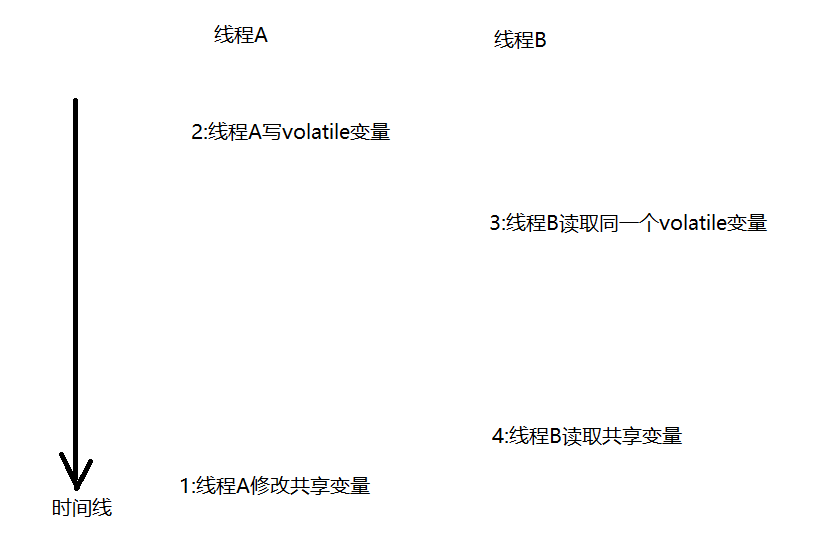

#1 volatile的内存语义
当声明变量为volatile后，对这个变量的读/写将会很特别，为了深入理解volatile实现的原理，接下来学习volatile的内存语义和volatile的内存语义的实现

## 1.1 volatile的特性

理解volatile的特性的一个好办法是把对volatile变量的单个读/写，看成是使用同一个所对这些单个读/写操作做了同步。例如：

volatile代码实例

    public class VolatileFeatureExample {

        volatile long v1 = 0L;//声明volatile的变量

        public void set(long l) {//volatile 的set
            v1 = l;
        }

        public void getAndIncrement() {//复合volatile的读/写
            v1++;
        }

        public long get() {//volatile的读
            return v1;
        }
    }

上面代码示例等同于下面同步后的代码

    class VolatileFeatureExample2 {

        long v1 = 0L;//声明普通变量

        public synchronized void set(long l) {//同步的写
            v1 = l;
        }

        public void getAndIncrement() {
            long temp = get();//同步的读
            temp += 1L;//普通的写
            set(temp);//同步写
        }

        public synchronized long get() {//同步的写
            return v1;
        }
    }

锁的happens-before规则保证释放锁和获取锁的两个线程之间的内存可见性，这意味着：**对一个volatile变量的写，总是能看到（任意线程）对这个volatile变量最后的写入。**

而锁的临界区的执行具有原子性，意味着即使是对64位数据的变量类型，只要他们是volatile的，对该变量的读/写都具有原子性，**但是多个volatile变量的操作，类似volatile++这种复合操作，不具有原子性**。

所以总得volatile变量自身具有如下特性：
- 可见性 对一个volatile变量的读，总是可以看到任意线程对这个volatile变量的写
- 原子性 对任意单个volatile变量的读/写都具有原子性，但类似于volatile++这种复合的volatile操作，不具有原子性

## 1.2 volatile写-读建立的关系

从JSR-133(JDK5)开始，volatile变量的写-读可以实现线程之间的通信,从内存语义来讲，volatile的的写读操作与所的释放-获取具有相同的效果，即volatile的写与锁的释放具有相同的语义，volatile的都与锁的获取具有相同的语义。如：

    class VolatileExample {
         int a = 0;              
         boolean flag = false;

        public void writer() {
            a = 1;                   //步骤1
            flag = true;             //步骤2
        }

        public void reader() {

            if (flag) {                    //步骤3
                int i = a;                 //步骤4
                System.out.println(i);     
            }
        }
    }

           new Thread(new Runnable() {//A
                @Override
                public void run() {
                    volatileExample.writer();
                }
            }).start();

            new Thread(new Runnable() {//B
                @Override
                public void run() {
                    volatileExample.reader();
                }
            }).start();

*`如果`* **线程A执行writer后线程B执行reader**，根据happens befor规则，这个过程建立的happens bofore关系如下：

- 1 happens bofore 2
- 3 happens bofore 4
- 根据volatile的内存语义，2  happens bofore 3 (读 before 写)
- 根据 happens bofore的传递性，1  happens bofore 4

## 1.3 volatile写-读内存语义
** volatile写的内存语义**：
当写一个volatile变量时，JMM会把该线程对应本地内存中的共享变量刷新到主内存中去。
** volatile读的内存语义**：
当读一个volatile变量时，JMM会把该线程对应的本地内存置为无效，线程接下来将从主内存中读取该变量。
用线程间的通信的说法就是，线程A写一个volatile变量，随后线程B读取这个volatile变量，这个过程实质上是线程A通过主内存向线程B发现消息。

## 1.4 volatile内存语义的实现

为了实现volatile的内存语言，JMM会分别限制两种类型的重排序类型，限制的重排序类型如下，NO表示禁止的重排序。

|  第一个操作\第二个操作 | 普通读写  | volatile读  | volatile写  |
| ------------ | ------------ | ------------ | ------------ |
|  普通读写 |   |   |  NO |
| volatile读  |  NO | NO  |  NO |
| volatile写  |   | NO  |  NO |

举例说明，第一行第三列的NO表示，如果第一个操作是普通的读/写操作，而第二个操作是volatile写操作的话，JMM就会进程这两个操作的重排序。

JMM采取的方式是：

- 在每个volatile写操作前面插入一个StoreStore内存屏障
- 在每个volatile写操作后面插入一个StoreLoad内存屏障
- 在每个volatile读操作前面插入一个LoadLoad内存屏障
- 在每个volatile读操作后面插入一个LoadStore内存屏障

JMM采取的策略是保存策略——首先保证正确性，再去追求执行效率

## 1.5 JSR-133为什么要增强volatile的内存语义
在JSR-133之前，JMM虽然不允许volatile变量之间的重排序，但是运行volatile变量与普通变量重排序。

旧的内存模型中程序的操作可能被重排序成下列时序执行：

在旧的JMM中，当1和2之间没有数据依赖时，1和2之间的操作就可能被重排序，3和4的执行结果是：线程B执行4时，不一定能看到线程A在执行1时对共享变量的修改。

用代码来说明就是：

    class VolatileExample {
             int a = 0;              
             boolean flag = false;

            public void writer() {
                a = 1;                   //步骤1
                flag = true;             //步骤2
            }

            public void reader() {

                if (flag) {                    //步骤3
                    int i = a;                 //步骤4
                    System.out.println(i);     
                }
            }
        }

线程A执行writer，然后线程B执行reader，由于1和2可以被重排序，所以线程B在执行4时，可能看不到线程A对变量a的修改。

在旧的JMM中，volatile的写都没有锁释放和锁获取操作所具有的内存语义，为了提供一种比锁更轻量级的线程之间的通信机制，JSR-133专家们决定之前对volatile的内存语义。

>对volatile的学习就到这里了，这里只是对《java并发编程的艺术》重点部分的记录，如果对java并发编程感谢的话，强烈推荐这本书。
